# TCP Viewer

<p align="center">
  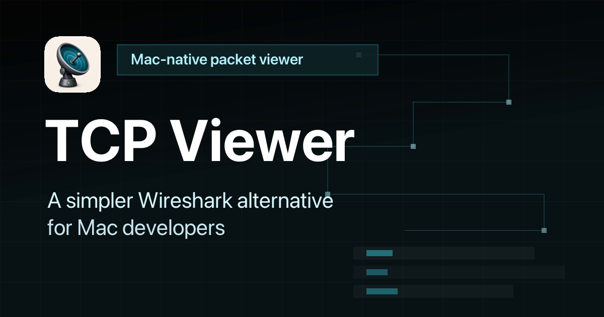
</p>

<p align="center">
  A simple, native packet viewer for Mac.
</p>

<p align="center">
  <a href="https://tcpviewer.proxyman.com">Website</a> ·
  <a href="https://api-tcpviewer.proxyman.com/api/releases/download/tcpviewer.dmg">Download</a> ·
  <a href="https://tcpviewer.proxyman.com/docs/">Docs</a> ·
  <a href="https://github.com/ProxymanApp/TCPViewer/releases">Releases</a>
</p>

TCP Viewer captures and reads network packets on macOS. It uses system `libpcap` for capture and Wireshark libraries for deep packet details.

## Features

- Native macOS app, built with AppKit
- Built on top of Wireshark Lib, alternative to Wireshark
- Capture live traffic.
- Group packets by app, domain, or IP address.
- Filter TCP, UDP, DNS, HTTP, TLS, WebSocket, and more.
- Read protocol fields and raw bytes.
- Open PCAP and PCAPNG files.
- Follow a full TCP stream.
- Export packets as PCAP or PCAPNG.
- Ask an AI agent about your capture with TCP Viewer MCP.
- Automate capture, packet queries, files, licenses, and settings with [`tcpviewer-cli`](CLI.md).
- Review the full source code.

### Easy packet capture

- Pick a network interface.
- Start or stop with one click.
- Keep busy captures easy to read.

[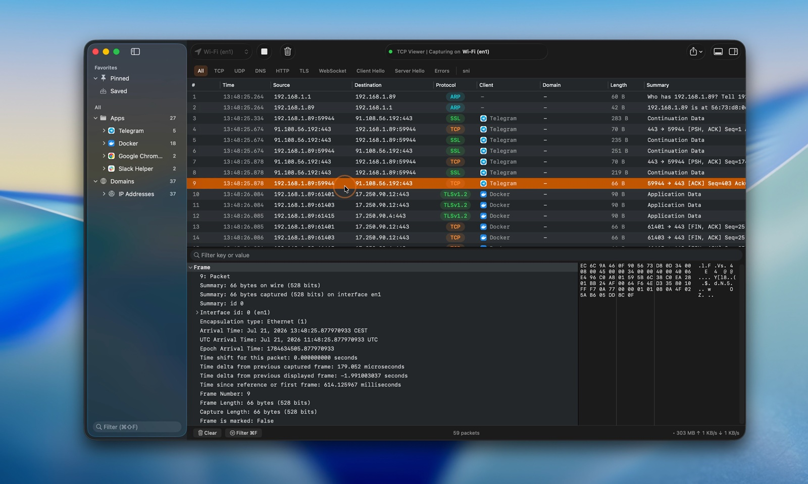](https://tcpviewer.proxyman.com/demo/main-demo.mp4)

[Watch the live capture video](https://tcpviewer.proxyman.com/demo/main-demo.mp4)

### TCP Viewer MCP

- Connect TCP Viewer to Codex or another MCP client.
- Check the capture status.
- List network interfaces.
- Find packets with a simple prompt.
- Available with TCP Viewer PRO.

<p align="center">
  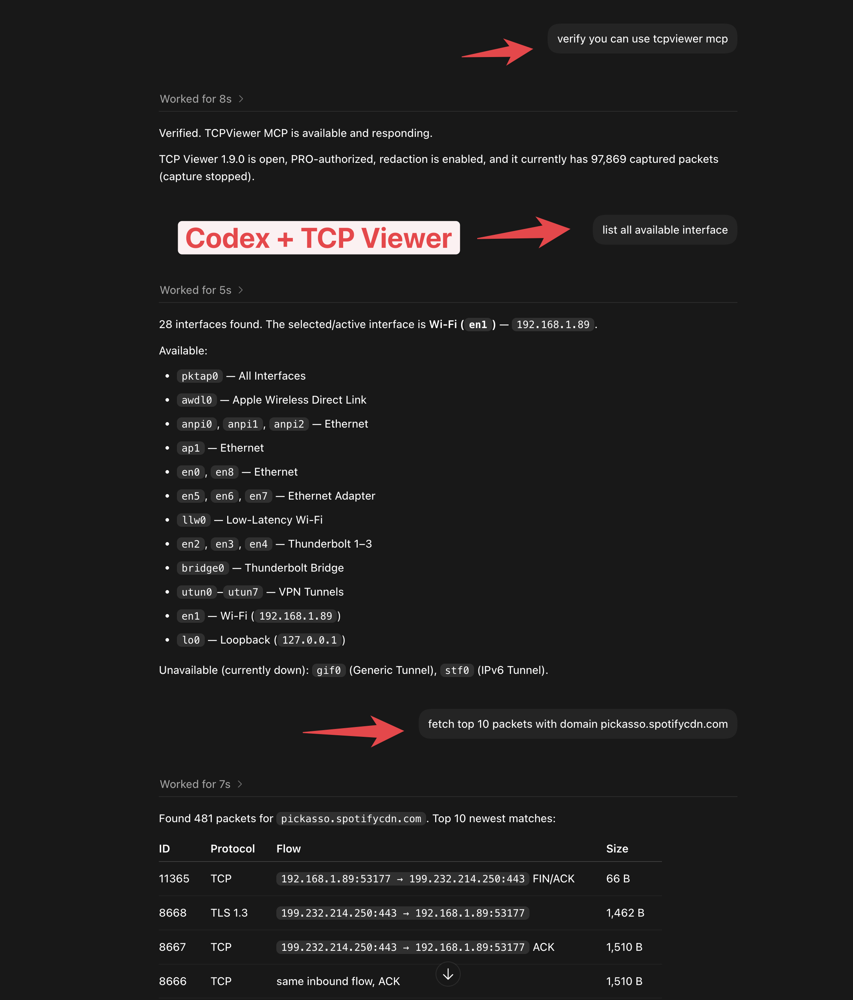
</p>

### Open capture files

- Drag in a PCAP or PCAPNG file.
- Preview packets right away.
- Use the same view as a live capture.

[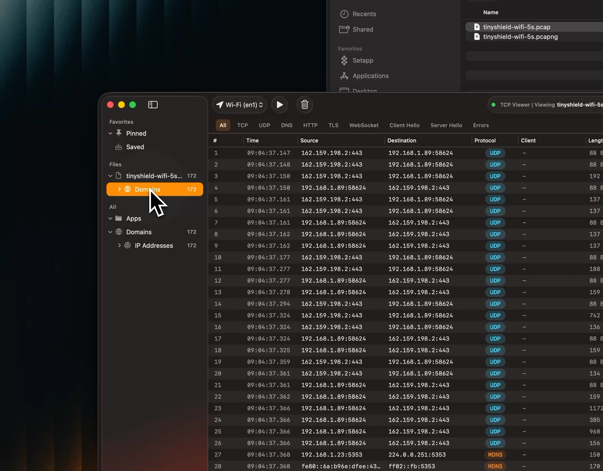](https://tcpviewer.proxyman.com/demo/open-pcap.mp4)

[Watch the file preview video](https://tcpviewer.proxyman.com/demo/open-pcap.mp4)

### Follow TCP Stream

- Rebuild one full TCP conversation.
- Show both directions together.
- Show only client or server data.
- Switch between text and hex.
- Search the stream.
- Jump back to the source packet.

[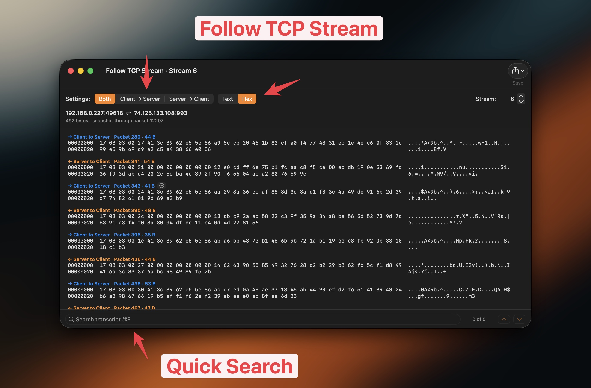](https://tcpviewer.proxyman.com/demo/follow-tcp.mp4)

[Watch the Follow TCP Stream video](https://tcpviewer.proxyman.com/demo/follow-tcp.mp4)

### Group traffic

- Group packets by app.
- Group packets by domain.
- Group packets by IP address.
- Jump to the traffic you need.

[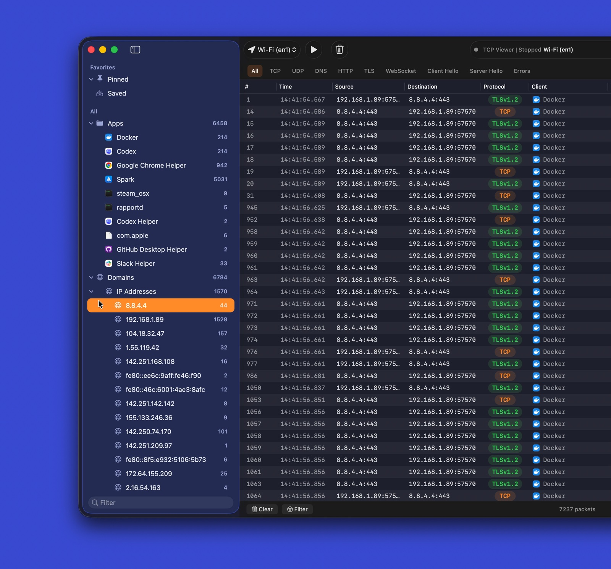](https://tcpviewer.proxyman.com/demo/group-by-app-domains.mp4)

[Watch the grouped traffic video](https://tcpviewer.proxyman.com/demo/group-by-app-domains.mp4)

### Protocol filters

- Use quick filters for common protocols.
- Combine filters with text search.
- Focus on useful packets fast.

[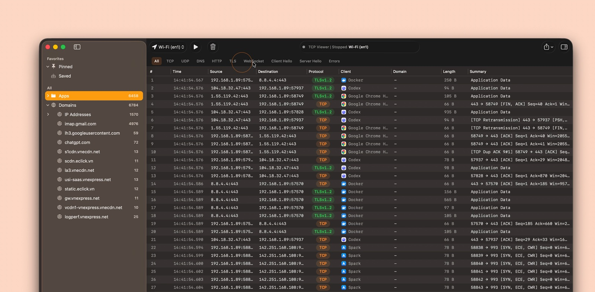](https://tcpviewer.proxyman.com/demo/advanced-filter.mp4)

[Watch the protocol filter video](https://tcpviewer.proxyman.com/demo/advanced-filter.mp4)

### Export captures

- Export all, filtered, or selected packets.
- Save as PCAP or PCAPNG.
- Open the result in other packet tools.

<p align="center">
  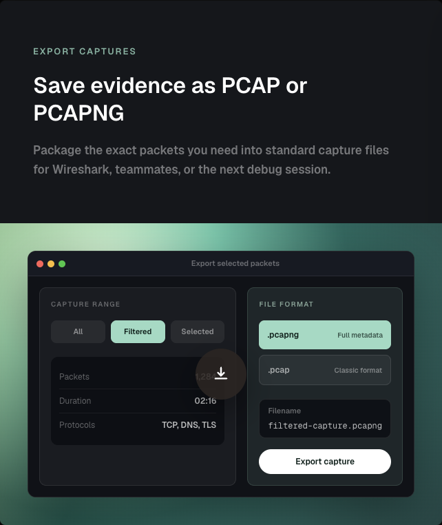
</p>

### Packet details

- Read Wireshark-grade protocol trees.
- Inspect field names and values.
- Match fields to raw bytes.
- Search packet details.

[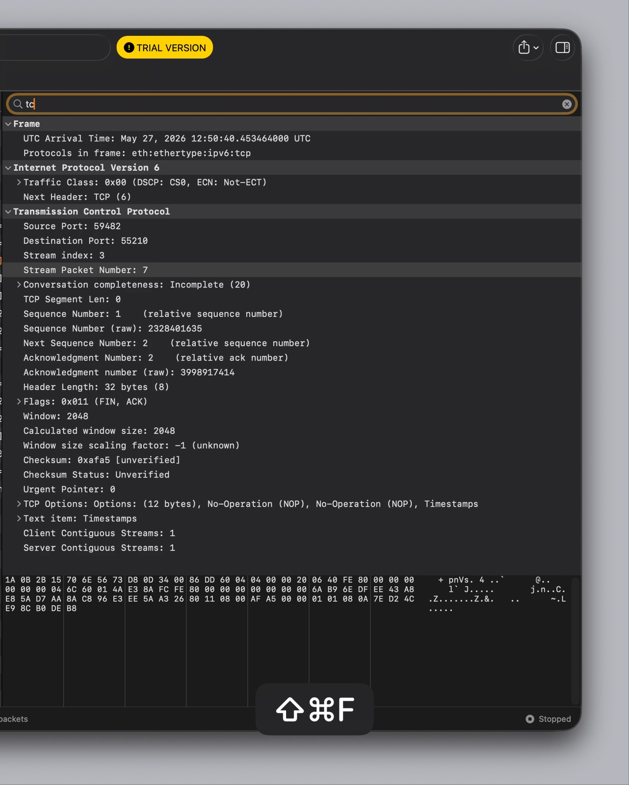](https://tcpviewer.proxyman.com/demo/detail-packet.mp4)

[Watch the packet details video](https://tcpviewer.proxyman.com/demo/detail-packet.mp4)

## Open source

- Licensed under GPL-2.0-or-later.
- Review the capture pipeline.
- Review packet decoding.
- Review the native macOS interface.
- Report issues or send a pull request.

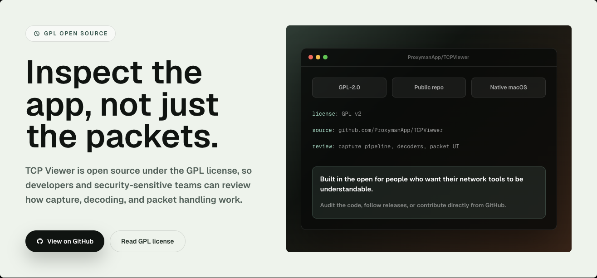

## Built by the Proxyman Team

- Made by the team behind [Proxyman](https://proxyman.com) and [Tiny Shield](https://tinyshield.proxyman.com/).
- Built for macOS.
- Focused on privacy and clear network debugging.

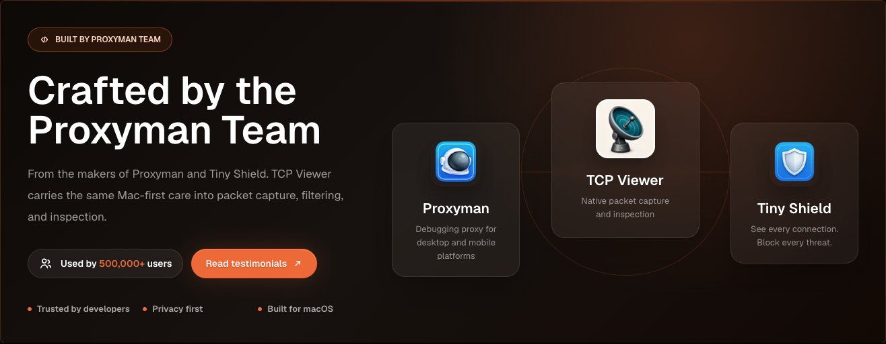

## Requirements

To run TCP Viewer:

- Apple Silicon Mac.
- macOS 15 or later.

To build TCP Viewer:

- Xcode 16 or later.
- Git.
- CMake, Ninja, Meson, pkg-config, and autotools.

```bash
brew install cmake ninja meson pkg-config autoconf automake libtool
```

## Setup

Clone with submodules. Then bootstrap the pinned Wireshark dependency.

```bash
git clone --recurse-submodules <repo-url>
cd TCPViewer
cp Config/TCPViewer.local.xcconfig.example Config/TCPViewer.local.xcconfig
./scripts/bootstrap-wireshark.sh
```

Already cloned without submodules?

```bash
git submodule update --init --recursive
./scripts/bootstrap-wireshark.sh
```

The bootstrap scripts:

- Run `scripts/bootstrap-wireshark-deps.sh` first.
- Build Wireshark's runtime libraries from source.
- Write them to `Vendor/.install/wireshark-deps`.
- Use macOS 15 as the deployment target.
- Use Homebrew only for build tools.
- Never copy Homebrew bottle dylibs into a release.

Keep local signing, appcast, Sparkle, Sentry, and release values out of Git. Use `Config/TCPViewer.local.xcconfig`, `.env`, environment variables, or Keychain-backed tools.

## Run

In Xcode:

1. Open `TCPViewer.xcodeproj`.
2. Select the `TCPViewer` scheme.
3. Choose `My Mac`.
4. Press Run.

Command-line build:

```bash
xcodebuild -project TCPViewer.xcodeproj -scheme TCPViewer build
```

If Xcode asks for signing, select a development team for `TCPViewer` and `PcapPlusPlusCore`.

## Test

```bash
xcodebuild test \
  -project TCPViewer.xcodeproj \
  -scheme TCPViewer \
  -destination 'platform=macOS'
```

## Release

The release script can:

- Build and notarize the app.
- Sign the Sparkle update.
- Upload files to Cloudflare R2.
- Publish the release to the backend.

First-time setup:

```bash
npm install
bundle install
gh auth login
```

Create a local `.env` from `.env.example`. Add the required release values. Never commit real secrets.

Use `#` for comments in `.env`. `sentry-cli` does not accept `//` comments.

For a production release, add a matching entry to `ReleaseNote.json`. Then run:

```bash
npm run release
```

Choose `beta` or `production` when asked.

Production releases also:

- Create the Sparkle appcast.
- Push the `v<version>` tag.
- Publish the GitHub release.

To create only the Homebrew Cask pull request for the latest public production
release, run `make build` and choose `Homebrew Cask PR from latest release`.
You can also run the direct command:

```bash
npm run release:homebrew
```

This verifies the public DMG against the GitHub release asset, pushes a branch to
`ProxymanApp/homebrew-cask`, and opens the contribution pull request in
`Homebrew/homebrew-cask`.

Artifacts are written to:

```bash
~/Desktop/tcpviewer-production/
```

## License

TCP Viewer is licensed under GPL-2.0-or-later. This matches its use of Wireshark libraries.

- See `COPYING` for the full GPL text.
- See `THIRD_PARTY_NOTICES.md` for third-party notices.
- See `SOURCE_CODE_OFFER.md` for binary release source terms.

## Acknowledgements

- [Wireshark](https://www.wireshark.org/) provides packet dissection.
- [HexFiend](https://github.com/HexFiend/HexFiend) provides the embedded hex viewer.

Wireshark is a trademark of the Wireshark Foundation. TCP Viewer is not affiliated with or endorsed by the Wireshark Foundation.
